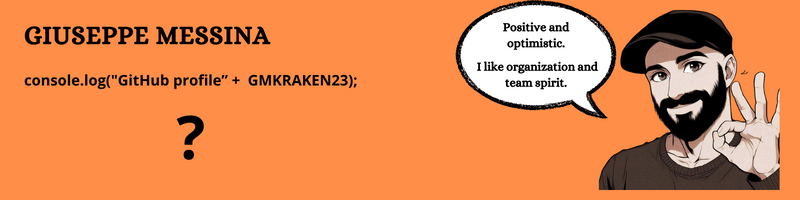

### Hi, I'm GIUSEPPE 👋
---

🇧🇪 - I'm a Belgian web developer  
💻 - I love learning web and mobile coding  
🎯 - My objective: full-stack JavaScript developer  
🗺️ - My roadmap : JavaScript - TypeScript - React - Node.js - Express.js - MongoDB  
📖 - Currently learning : Next.js

🖥️ Click here to view my portfolio: [Click!](https://www.giuseppe-messina-dev.com)

## Skills : 

### Tools 

### Front-End  

### Back-End  

### Full-Stack

## Contact Me! 

  
  &nbsp;&nbsp;&nbsp;&nbsp;
  

