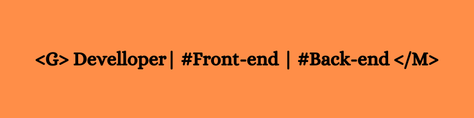

### Hi, I'm GIUSEPPE 👋
---

I'm a web developer based in Belgium. In the realm of programming, I emphasize versatility as my creative inclinations propel me to undertake comprehensive projects. This is why I have chosen the path of a full-stack developer. Additionally, I derive great satisfaction from acquiring knowledge in concepts closely or remotely related to programming, such as UX design, SEO, project management, ...

## Front-end skills :     

## Back-end skills : 

## Concepts :    

## People skills :   

